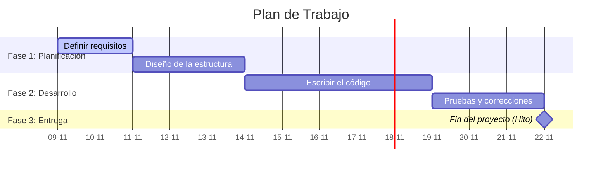

# Mi Cronograma de Proyecto
Diagrama ejemplo

```mermaid
gantt
    title Plan de Trabajo
    dateFormat  YYYY-MM-DD
    axisFormat  %d-%m
    
    section Fase 1: Planificación
    Definir requisitos       :active, t1, 2026-11-09, 2d
    Diseño de la estructura  :t2, after t1, 3d
    
    section Fase 2: Desarrollo
    Escribir el código       :t3, after t2, 5d
    Pruebas y correcciones   :t4, after t3, 3d
    
    section Fase 3: Entrega
    Fin del proyecto (Hito)  :milestone, t5, after t4, 0d
```
